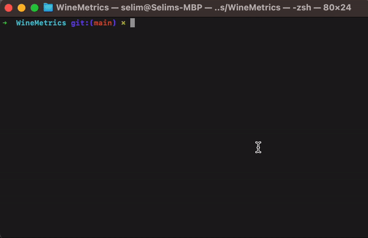

# WineMetrics: Wine Quality Prediction



## About The Project

WineMetrics is a Python-based machine learning project that predicts wine quality through a custom-built multiple linear regression model. Developed entirely from scratch, this project showcases the implementation of batch gradient descent to learn model weights and biases, demonstrating a deep understanding of foundational machine learning concepts.

### Built With

- Python 3
- NumPy

## Features

- **Custom Linear Regression Model**: Unlike using pre-built models from libraries like scikit-learn, WineMetrics features a linear regression model developed from the ground up.
- **Batch Gradient Descent**: The model uses batch gradient descent for optimization, providing insights into the inner workings of this fundamental algorithm.
- **Interactive Predictions**: Users can input wine characteristics to receive a quality prediction, making the model interactive and user-friendly.

## Getting Started

To run WineMetrics on your local machine, follow these steps:

### Prerequisites

- Ensure you have Python 3 installed on your system. You can download it from [python.org](https://www.python.org/downloads/).

### Installation

1. Clone the repository:

```bash
git clone https://github.com/yourusername/WineMetrics.git
```

2. Navigate to the WineMetrics directory:

```bash
cd WineMetrics
```

3. Make sure NumPy is installed. If not, install it using pip:

```
pip install numpy
```

### Usage

Run the program using Python 3:

```
python3 main.py
```

Follow the on-screen prompts to input wine characteristics and receive a quality prediction.

## Data Source

The training data for WineMetrics is sourced from the [UCI Machine Learning Repository](https://archive.ics.uci.edu/ml/datasets/wine+quality), ensuring a robust and reliable model.

## You may also like...

- [Distancia](https://github.com/selimellieh72/Distancia) - Digitializing education
- [Zoey](https://github.com/Ghaadyy/book-app-frontend) - Exchanging books

---

> [selimellieh72.github.io](https://selimellieh72.github.io) &nbsp;&middot;&nbsp;
> GitHub [@selimellieh72](https://github.com/selimellieh72) &nbsp;&middot;&nbsp;
> Twitter [@selim_ellieh](https://twitter.com/selim_ellieh)
